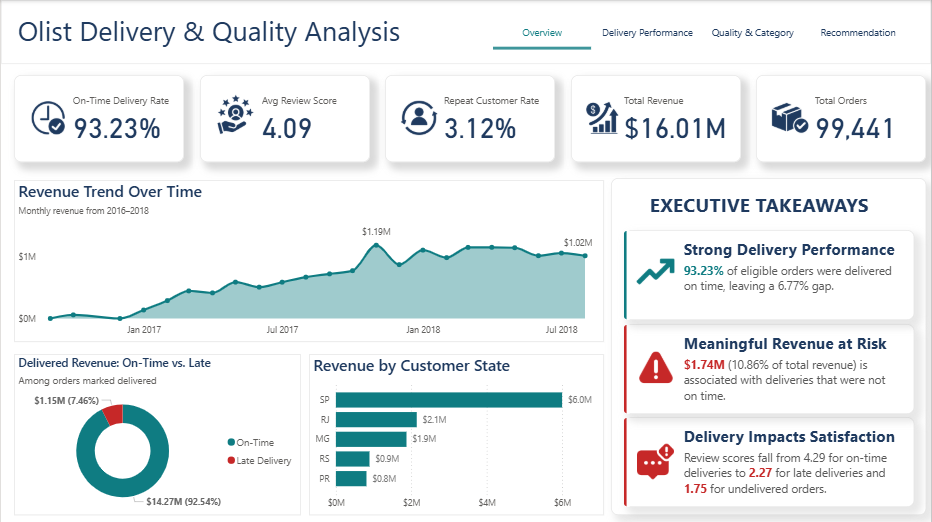
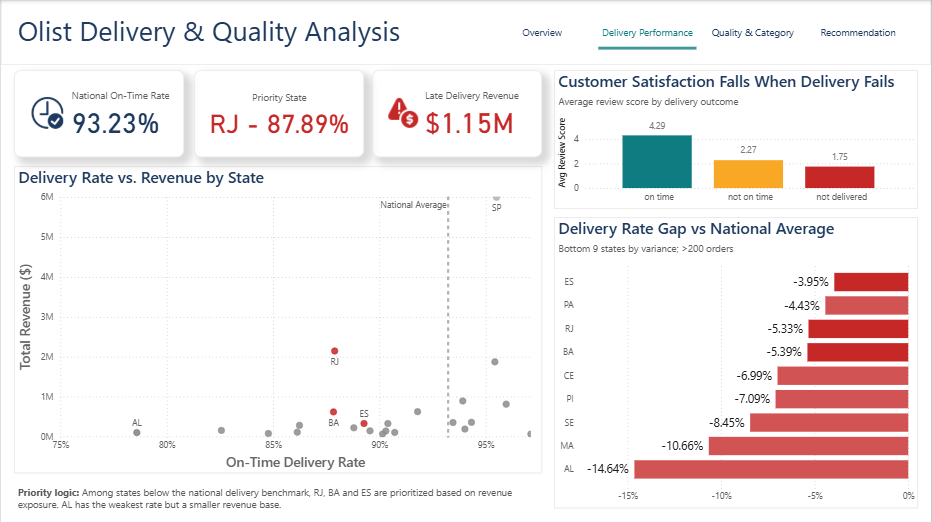
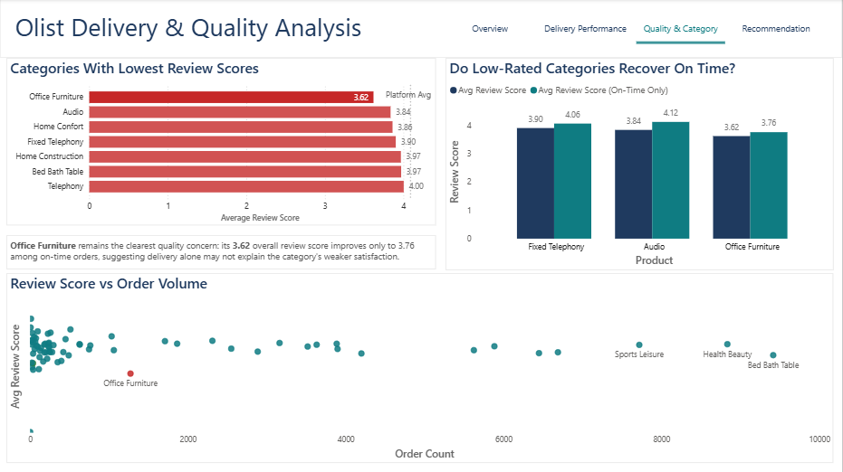
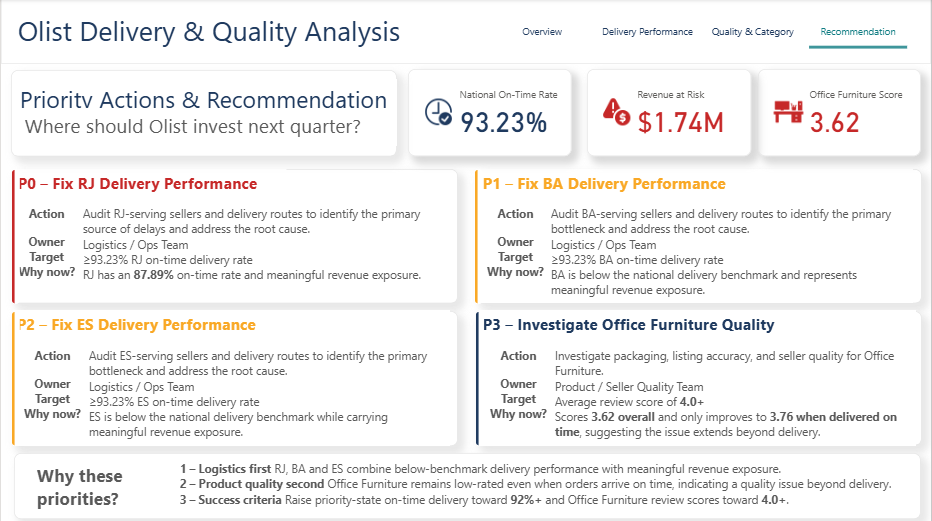

# Olist Delivery & Quality Analysis

**SQL Server · Power BI · DAX · Power Query**

An end-to-end analysis of Olist's e-commerce operations focused on
delivery reliability, revenue exposure, customer satisfaction, and
product-category quality.

## Business Question

> Should Olist prioritize delivery logistics or product/seller quality
> investment next quarter to improve customer satisfaction and repeat
> purchase?

---

## Key Findings

- **93.23%** of eligible orders were delivered on time.
- **$1.74M (10.86%)** of total revenue is associated with deliveries
  that were not on time.
- Average review scores decline from **4.29** for on-time deliveries
  to **2.27** for late deliveries and **1.75** for undelivered orders.
- **RJ, BA, and ES** were prioritized for delivery intervention based
  on below-benchmark performance and meaningful revenue exposure.
- **Office Furniture** remains a quality concern, with a **3.62**
  overall review score and **3.76** among on-time orders — indicating
  the issue is not fully explained by delivery performance.
- Repeat purchase rate sits at **3.12%**, which is low relative to
  typical e-commerce benchmarks (commonly 10–30%+), suggesting
  retention may warrant a separate investigation beyond delivery and
  quality alone.

---

## Recommendations

| Priority | Action |
|---|---|
| **P0** | Fix RJ delivery performance |
| **P1** | Fix BA delivery performance |
| **P2** | Fix ES delivery performance |
| **P3** | Investigate Office Furniture quality |

The recommendations distinguish between **delivery problems** and
**category-level quality problems**, rather than treating all customer
satisfaction issues as logistics issues.

---

## Viewing the Dashboard

Download `Olist_Delivery_Quality_Analysis.pbix` from the `dashboard/`
folder and open it in [Power BI Desktop](https://www.microsoft.com/en-us/power-platform/products/power-bi/downloads)
(free) to interact with filters, slicers, and drill-downs. Static
previews of each page are below.

### Overview


### Delivery Performance


### Quality & Category


### Recommendations


---

## Technical Approach

### SQL Server / SSMS

Created two analytical views:

- `fact_orders` — order-level analysis integrating orders, customers,
  reviews, and payments.
- `fact_order_items` — order-item analysis integrating products and
  category information.

The SQL layer also handles review deduplication, payment aggregation,
and delivery-status derivation.

The `sql/` folder preserves the full analytical trail — from the
production views, through data-quality checks (including a
review-deduplication bug caught and fixed during development), to
the queries behind the state and category prioritization and the
final metric validation against the Power BI DAX measures.

### Power BI / DAX

Built the reporting model and developed measures for:

- On-Time Delivery Rate
- Avg Review Score
- Repeat Customer Rate
- Total Revenue
- Total Orders
- Revenue at Risk
- Variance from Avg (state-level delivery benchmark comparison)

The full set of measures — including revenue decomposition, customer
segmentation, and category-quality support measures — is documented in
[`dax/measures.md`](dax/measures.md).

---

## What Was Hard

The most difficult part of this analysis was isolating **category-level
quality issues** from **delivery-driven dissatisfaction**. Low review
scores alone don't reveal their cause, since late deliveries and poor
product quality both drag scores down in similar ways. To separate the
two, review scores were re-calculated using **on-time orders only** —
if a category's score stayed low even without delivery problems in the
mix, that pointed to a quality issue rather than a logistics one. This
is what confirmed Office Furniture as a genuine product/seller quality
concern rather than a delivery symptom.

---

## Limitations & Next Steps

- This analysis is **correlational**, not causal — it identifies
  *where* delivery and quality issues occur, not their root causes
  (e.g., specific carrier performance, warehouse location, or seller
  fulfillment practices).
- **ES has a smaller order volume** than RJ and BA, so its revenue
  exposure estimate carries more uncertainty than the other two
  priority states.
- **Seasonality was not controlled for.** Delivery delays may cluster
  around peak shopping periods, which could overstate or understate
  a state's underlying performance.
- **Repeat purchase rate** is reported as a headline metric but not
  deeply investigated here — it's flagged as an area for separate
  analysis rather than assumed to be delivery/quality-driven.
- **Next step:** incorporate carrier/logistics-partner data (if
  available) to determine whether delivery delays are seller-side or
  logistics-side, which would sharpen the P0–P2 recommendations from
  "fix delivery in this state" to a specific operational cause.

---

## Tools

**SQL Server · SSMS · Power BI · DAX · Power Query**

---

## Data Source

This project uses the [Olist Brazilian E-Commerce Public Dataset](https://www.kaggle.com/datasets/olistbr/brazilian-ecommerce)
(Kaggle). The raw dataset is not included in this repository — see
[`documentation/data-model.md`](documentation/data-model.md) for
details on the tables used and how they were transformed.

---

## Repository Structure

```text
olist-delivery-quality-analysis/
│
├── README.md
├── dashboard/
│   ├── Olist_Delivery_Quality_Analysis.pbix
│   └── screenshots/
│       ├── overview.png
│       ├── delivery-performance.png
│       ├── quality-category.png
│       └── recommendations.png
├── sql/
│   ├── 01_final_views.sql
│   ├── 02_data_quality_investigation.sql
│   ├── 03_state_priority_analysis.sql
│   ├── 04_category_quality_analysis.sql
│   └── 05_metric_validation.sql
├── dax/
│   └── measures.md
└── documentation/
    └── data-model.md
```